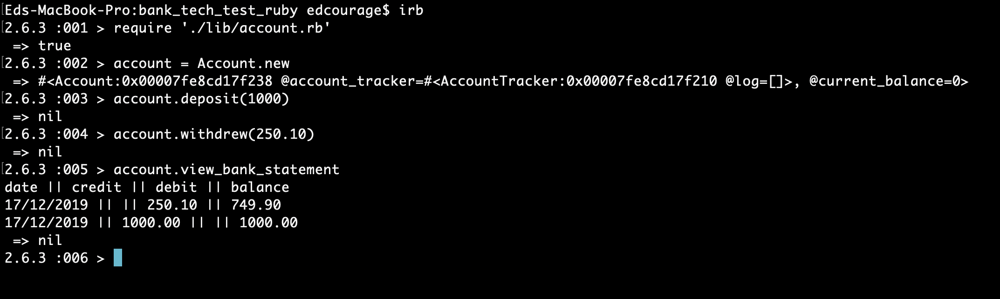

## Bank Tech Test


#### Setting Up Project
 - `bundle install`
 
#### Running Tests
	
 - `rspec`
 - `rubocop`_(Not all are passing)_
	
#### Running Program

_This program will run using a REPL (IRB)_

 - `require './lib/account.rb'`
 - `account = Account.new`

 ##### Deposit
 - account.deposit(_amount_)
 - _example_ `account.deposit(1000)`

  ##### Withdrawal
 - account.withdrew(_amount_)
 - _example_ `account.withdrew(250.10)`

 ##### Print Bank Statement
 - `account.view_bank_statement`
 ###### example output

 ```
 date || credit || debit || balance
16/12/2019 || || 250.10 || 749.90
16/12/2019 || 1000.00 || || 1000.00
```

     
 ## User Story's

 ```
 As a customer
 So I can have somewhere to store my money,
 I would like to add money(deposit) to my account

 As a customer
 So I can use my account,
 I would like to take money (withdrew) from my account

 As a customer
 So I can keep track of my account,
 I would like to see a bank statement with all my deposits, withdrawals neatly laid out
 ```
